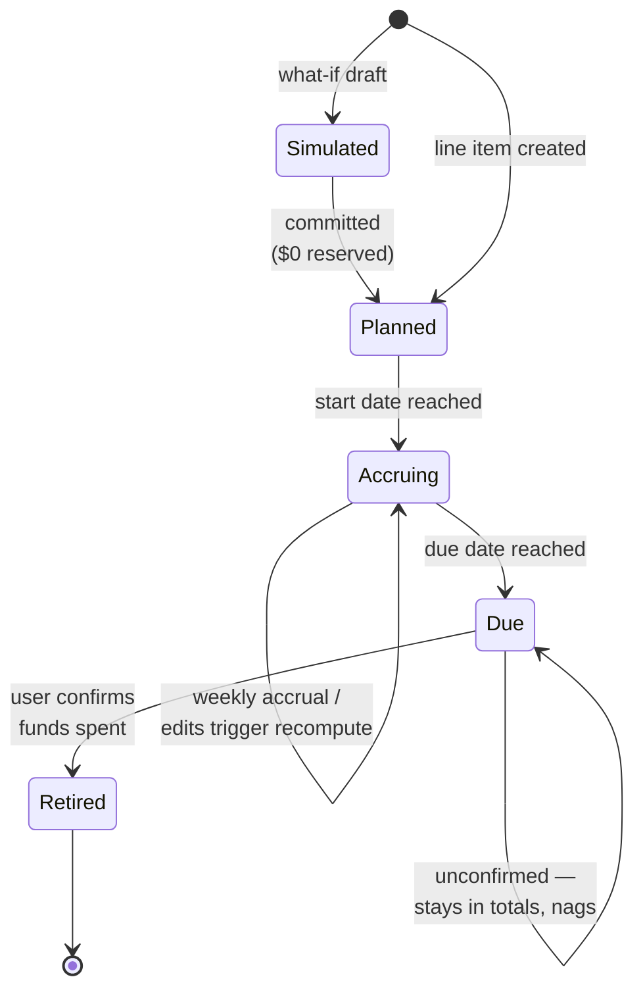

# Family Reserve Planner — Product Abstract

Sep 19, 2026 · @Josh Morganthall

## Problem

Our family reserve system works, but every plan change costs hours of manual recomputation. Today we identify future non-monthly expenses, compute a weekly savings rate by hand (in a Google Sheet), mirror that rate as a recurring transfer expectation in Simplifi, and set up the actual recurring transfer in Capital One 360. The reserved money physically leaves circulation, which is what makes the system work.

The failure mode is change. Example: a Disney trip planned months out has line items with different deadlines — airfare must be bought early to avoid price increases, park tickets and lodging are due 30 days out. Packaging those into one "save $X/week starting now" number is tedious manual work. When the plan changed (two more travelers joined), recomputing every line item, the weekly rate, the Simplifi expectation, and the Cap One transfer meant redoing all of it by hand.

There is also no ongoing verification. Nothing tells us whether the reserve accounts actually contain what the plans say they should by today, whether a weekly rate has drifted from reality, or whether money for a passed deadline was actually withdrawn and spent.

## Product summary

A self-hosted family reservation engine that answers one question continuously: **"How much needs to move into each reserve account this week, and are the reserves on pace?"**

Users define packages of future expenses (each line item with its own amount, due date, and reserve bucket); the tool computes per-bucket weekly transfer rates, projects a should-have-saved curve, detects drift between projected and confirmed reserve balances, and recomputes everything in a few clicks when plans change.

It never moves money and never replaces Simplifi: Capital One 360 recurring transfers execute the plan, and Simplifi continues to handle aggregation, budgeting, and lookback analysis. The tool is the decision layer — the glue that today lives in a spreadsheet and a lot of manual effort.

## Core concepts

| Concept | What it is | Example |
| --- | --- | --- |
| **Reserve account** | A real Capital One 360 account where reserved money physically sits | Annual Expenses, Gifts & Giving, Long Term Savings |
| **Package** | A named group of related future expenses, planned and edited as a unit | "Disney Feb 2027" |
| **Line item** | One expense inside a package: amount × quantity, due date, reserve account | Park tickets, 3 × $600, due Jan 18, Annual Expenses |
| **Accrual schedule** | The computed save-per-week for a line item: remaining amount ÷ weeks until due | $54/week starting today |
| **Weekly rate** | Sum of all active accrual schedules, rolled up per package and per reserve account | "Annual Expenses: move $210/week" |
| **Should-have-saved curve** | For any date, what each package and account should contain if accruals ran on schedule | "Disney should hold $1,840 as of today" |
| **Confirmed balance** | The actual reserve-account balance the user confirms during a check-in | "Annual Expenses actually holds $1,650" |
| **Drift** | Confirmed balance minus should-have-saved, with a computed catch-up adjustment | "$190 behind → add $24/week for 8 weeks, or one-time $190" |

Line items are recurring-aware in a simple sense: quantity changes (1 traveler → 3) and date changes are ordinary edits that trigger recompute, not new planning sessions.

## Key capabilities

1. **Package builder.** Create a package, add line items with amounts, quantities, due dates, and target reserve accounts. The tool immediately shows the package-level weekly number and per-account rollup — the number that becomes a Cap One recurring transfer and a Simplifi expectation.

2. **Change recompute.** Any edit — quantity 1× → 3×, a due date slip, a new line item, a cancellation — recomputes accrual schedules from today forward. The tool asks the user to confirm what is reserved as of today, then outputs the new weekly rate plus the drift adjustment needed to stay on curve. Adding two travelers to a trip is a few clicks, not an afternoon.

3. **Should-have-saved visualization.** Per package and per reserve account: the accrual curve over time, the "should have by today" number, and the grand total each Cap One account should currently hold across all active packages.

4. **Drift detection and check-ins.** A recurring (weekly, via n8n) prompt to confirm actual reserve balances against expected totals. Behind pace → catch-up options; ahead → rate reduction option. Alerts push to both spouses.

5. **Deadline close-out.** When a line item's due date passes, the tool asks: "Did this get spent from the reserve account?" Only on user confirmation does the item retire and its amount leave the expected-balance math. Unconfirmed items keep the grand-total honest and keep nagging — no silent fall-off.

6. **Transfer instructions, not transfers.** Output is always an instruction: "Set Annual Expenses recurring transfer to $210/week" or "One-time move: $190." The user executes in Capital One 360 and mirrors the expectation in Simplifi.

### Lifecycle

A line item stays in the expected-balance math until a human confirms the money actually left the reserve account.

## Integration posture

The tool holds no bank credentials and moves no money. That is a design decision, not a limitation: Simplifi has no public API (unofficial wrappers exist but are fragile and TOS-risky), and Capital One's developer program is partner-only. The manual steps that remain — setting a recurring transfer, updating a Simplifi expectation — are rare (only on plan changes) and take seconds once the tool supplies the number.

| System | Role | Integration |
| --- | --- | --- |
| **This tool** | Decision layer: packages, accruals, drift, close-out | Self-hosted on Unraid; n8n for scheduled check-ins and notifications |
| **Capital One 360** | Enforcement: recurring transfers physically remove money from circulation | None (manual). User sets/adjusts transfers per tool instructions |
| **Simplifi** | Aggregation, budgeting, lookback analysis; sees Cap One transfers automatically | None required. Optional later: CSV import or unofficial API, read-only, best-effort |

Future option, explicitly out of scope for v1: read-only balance ingestion (SimpleFIN Bridge or Simplifi CSV) to pre-fill the confirmation step so check-ins become one-tap approvals instead of manual balance entry.

## Users and success criteria

Two users, both first-class. **Shelby** is the primary planner — the Disney package was her work — so package creation and editing must be easy enough that she prefers it to the spreadsheet. **Josh** administers the system and the homelab it runs on. Both receive drift alerts and can confirm balances and close-outs.

Design principles: **mobile-first** (planning and confirmations happen from a phone), and **plain language** for non-technical, non-accounting users — "money set aside for the Disney trip," not "accrued liability." Tooltips carry the nerdy detail for those who want it. If Shelby can't run the whole system from her phone without asking Josh what a word means, the GUI has failed.

Success looks like:

- A plan change (add a traveler, slip a date) takes under 2 minutes end-to-end, including the new Cap One number.
- Weekly lifestyle spending stays flat regardless of paycheck size or timing — the smoothing outcome the system exists for.
- Reserve-account balances match should-have-saved totals within a small tolerance at every check-in, or a catch-up plan exists.
- No line item silently disappears: every passed deadline is explicitly confirmed spent.
- The Google Sheet is retired.

## Future modules (post-v1)

### Debt Priorities

Replace the Debt Priorities tab of the Google Sheet with a debt inventory, the existing priority-scoring model, and a new lump-sum optimizer. The sheet's current model, reverse-engineered from the live tab and verified against every row:

- **Inventory per debt:** name, category (Consumer / Auto / Mortgage), balance + as-of date, credit limit and utilization, APR, minimum-payment rule (fixed monthly amount, % of balance, or $ floor), principal/interest split of the minimum, and a fixed-payment flag for installment loans.
- **Scoring:** Long Term = APR ÷ 30% (avoided-interest weight, capped scale). Short Term = minimum payment ÷ balance, normalized to the highest ratio across all debts (cash flow freed per dollar paid off). Priority = 70% × Long Term + 30% × Short Term. The 70/30 weighting is user-adjustable — a simple slider between "avoid the most interest" and "free up cash flow now," because in a cash crunch the right move is whatever relieves monthly obligations fastest. Changing the weight instantly re-sorts the priority ladder and re-runs the lump-sum optimizer.
- **Snowball ladder:** debts sorted by priority, with cumulative payoff cost, cumulative monthly cash freed, and break-even months (cumulative cost ÷ cumulative freed) at each rung.
- **Payoff projections per debt:** months/years and estimated payoff date at minimums vs. debt-snowball (a set extra monthly amount plus freed minimums cascading down the priority order).

Two upgrades over the sheet, both driven by real cases:

- **Promo-rate awareness.** 0%-until-date and "this portion of the balance at a different rate until a date" rules (balance transfers, deferred-interest purchases). A 0% APR scores zero Long Term today, so the sheet cannot see the expiry cliff coming; the app should raise a debt's effective priority as its promo end date approaches, early enough to clear the balance before interest lands.
- **Lump-sum optimizer.** The ladder answers "which debt to eliminate next"; the app must also answer "given this specific amount (the Allocation Engine's 50% share), which debt(s) get it?" — recommending a split when partial payments across debts beat concentrating on one, using the same short-term + long-term objective.

Same confirmation loop as reserves: recommendation → user confirms the payment happened → balances, scores, and projections update.

### Allocation Engine (the family system)

Drop in one number — the unallocated floor from Simplifi's forward cash flow minus the buffer (e.g., $2,500 lowest unclaimed cash − $350 buffer = $2,150) — and the tool distributes it by the family's standing rules:

| Share | Destination | Behavior |
| --- | --- | --- |
| 50% | Debt payoff | Handed to the Debt Priorities optimizer for a named recommendation |
| 25% | Lifestyle / Fun | Released half at a time per ~2-week pay period to avoid spending it all at once |
| 15% | Long Term Savings | Vacations, home improvements — lands in the reserve buckets |
| 10% | 911 Fund | Emergency reserve |

Percentages are configurable, not hard-coded. Output is a set of concrete instructions ("move $X to Long Term Savings, pay $Y on card Z"), each awaiting user confirmation before the system treats it as done. This turns today's administrative process into: drop in a number, get a recommended path, confirm when it happened.

### Simulate → commit

Any package can be created as a what-if: it shows the weekly rate it would demand and its effect on family cash flow ("what happens if this Disney trip 9 months out becomes a commitment?") without touching live rates, totals, or check-ins. Pulling the trigger converts it in one tap to a live package with $0 reserved as of today — accruals start immediately. This is core-engine plumbing (a draft state on packages), listed here because the planning modules below are its heaviest users.

### Package Intake contract

The architectural rule that makes the module system work: every specialized planner — cars, vacations, college, debt payoff plans, anything future — has the same terminal output, a package in a standard intake shape (package metadata + line items: label, amount × quantity, due date, target reserve account), delivered to the core engine in Simulated state. The core engine alone owns accruals, drift, check-ins, and commit; planner modules only know how to fill the intake template well for their domain. Even the manual package builder is just the first client of this contract. The intake schema is therefore a v1 data-model decision, designed for repeatability (every module targets it identically) and flexibility (a new planner is just an estimator that emits an intake — no core changes).

### Vehicles

Per-vehicle cost model: payment, insurance, fuel economy and fuel spend, and an expected-maintenance schedule (mileage- and time-based) that feeds sinking-fund line items into the reserve engine — tires and brakes get reserved for before they happen, not after.

### Vacation Planning

Purpose-built trip estimator (Disney especially): builds the line-item package — tickets, lodging, food, airfare, airport parking, rideshare — from trip parameters and per-person counts, with due-date intelligence baked in (airfare bought early to beat price increases, Disney due 30 days out). Its output is a simulated package, ready to commit.

### Where the modules converge

Reservations, debts, and allocations are all one primitive: scheduled cash outflows at various cycles (weekly, biweekly, monthly, quarterly, semi-annual, annual) plus human-confirmed actuals. Once all three live in the app, a unified inflow/outflow model becomes possible — "Josh, in 8 weeks your balance is projected to hit $0; increase weekly savings in this category by $X/week to smooth it." That predictive smoothing is the long-term destination, not a v1 feature.

## Commercial-path seams

The long-range possibility is a commercial product with direct transaction ingestion (SimpleFIN, Plaid, or similar) that could eventually replace Simplifi as the intake mechanism. The existing architecture already fits — the engine is the product; Simplifi and Capital One are the current adapters — so preserving the path costs three seams, not features:

1. **Household scoping from day one.** Every core object carries a `household_id`, and auth is real accounts rather than hardcoded users: the app is a standard OIDC client with Google as the first identity provider (both spouses use Google today). Identity lives in the IdP; household membership is an app-domain table, never an IdP concept — so providers can be added or swapped later (one issuer-URL change) without touching tenancy. A self-hosted IdP layer (e.g., Authentik for homelab-wide SSO) is an optional deployment choice, not an app dependency. This family is household #1. (Multi-tenancy is the worst possible retrofit; the column is free now.)

2. **Confirmation as an interface.** A check-in answers "how does the system learn an actual?" Events record their source: manual entry (v1's only implementation) or feed. When ingestion arrives, matched transactions become a second implementation that pre-fills or auto-confirms check-ins — and only then does Transaction pass the litmus test and become the seventh core object.

3. **Ingestion as a port.** A source-agnostic ingestion boundary (CSV, SimpleFIN, Plaid) is defined in v1 even though nothing implements it; bank- or provider-specific logic never enters the core engine.

Explicitly unchanged: v1 scope and the no-credentials posture. Even commercially, transaction access goes through a read-only aggregation provider — this system never holds bank credentials. **Guardrail: the commercial path adds columns and interfaces to v1, never features.**

## Data-model principles

Two opposite failure modes to design against: **object explosion** (a first-class object per concept, each with its own CRUD, screens, and migrations) and the **anemic model** (too few objects plus a pile of one-off transformation glue that becomes unmaintainable). The rules below hold the line between them and are binding on the PRD and the build.

1. **Store facts, compute derivations.** Only human assertions are stored: what was planned, what was confirmed, what the rules are. Accrual schedules, weekly rates, should-have-saved curves, drift, priority scores, snowball ladders, allocation splits, and projections are pure functions over stored facts, computed on read and never persisted. If it can be recomputed, it is not an object — it is a view. (Stored derivations are the root cause of sync glue.)

2. **Promotion litmus test.** A concept becomes a first-class object only when all three hold: it has its own lifecycle/state machine, users refer to it by name as a thing, and putting it on an existing object would leave most fields null or overload their meaning. Simulation fails the test (a Package state). An allocation run fails (an Event). Debt passes (own lifecycle; APR, promo rules, and minimum-payment rules are meaningless on a LineItem).

3. **The core object set** — target is six, and growing it requires passing the litmus test:

| Object | What it stores | Why first-class |
| --- | --- | --- |
| **ReserveAccount** | Name, maps to a real Cap One account | Users name it; balances are confirmed against it |
| **Package** | Name, state (simulated / active / retired), module-owned detail blob | The planning unit; owns the lifecycle |
| **LineItem** | Label, amount × quantity, due date, target account, state | The accrual unit |
| **Debt** | Balance + as-of, APR, promo-rate rules, minimum-payment rule, limit | Distinct lifecycle and fields |
| **Event** | Append-only log: balance confirmed, payment confirmed, funds-spent confirmed, allocation entered | Current state = fold over events; free audit history |
| **Settings** | Allocation percentages, priority weights, buffer amount | The family's rules, versioned |

4. **Flexibility valve.** Planner modules put domain-specific richness (trip parameters, vehicle specs, per-person counts) in the Package's detail blob, owned and interpreted only by the emitting module. The core engine never reads it. Modules stay unboundedly flexible; the core schema never grows for them.

5. **One write path.** All creation and mutation of core objects goes through the intake contract and the engine's API — no module writes core data directly. One interpretation of the data exists: the engine's.

6. **Change ladder.** When a new requirement arrives, reach for solutions in this order: a new field → a new state → a new object (litmus test) → new glue code. A transformation script is a smell that the model is missing a field or a state, not a solution.

## Open questions for the PRD

- [ ] **Accrual math on edits:** pure re-spread (remaining ÷ weeks left) vs. preserving the original rate plus a separate catch-up line — which matches how you two think about it?
- [ ] **Recurring annual items** (insurance, property tax, Christmas): modeled as auto-renewing packages, or re-created each cycle?
- [ ] **Confirmation cadence:** weekly balance check-in for all accounts, or only when drift is suspected / a change occurs?
- [ ] **Front end:** dedicated web app on Unraid vs. n8n forms + notifications for v1?
- [ ] **Data store:** where do packages live (SQLite/Postgres on Unraid), and does the Google Sheet's history migrate in?
- [ ] **Notifications channel:** text, email, or push — and does Shelby confirm from her phone?
- [ ] **Paycheck awareness:** v1 assumes a constant weekly rate; is there ever a case for funding faster on high-paycheck weeks?
- [ ] **Debt optimizer objective:** how should short-term cash-flow relief and long-term interest avoided be weighted when they point at different debts?
- [ ] **Allocation cadence:** is the unallocated-floor number entered ad hoc (whenever you check Simplifi), per pay period, or monthly?
- [ ] **Module scope for v1:** reservations only, or reservations + allocation engine, with debt optimizer as v2?
